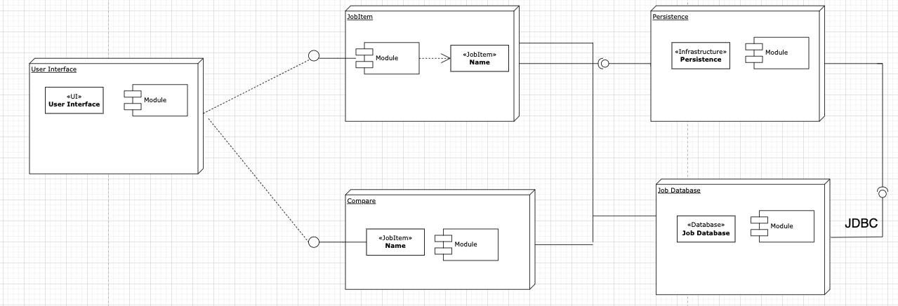
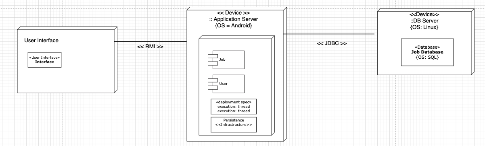
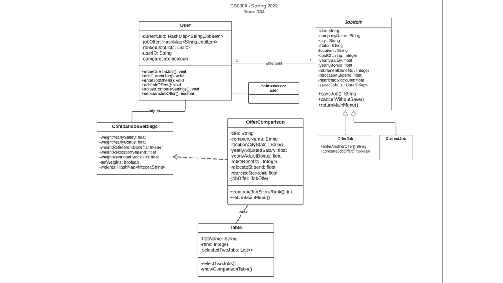
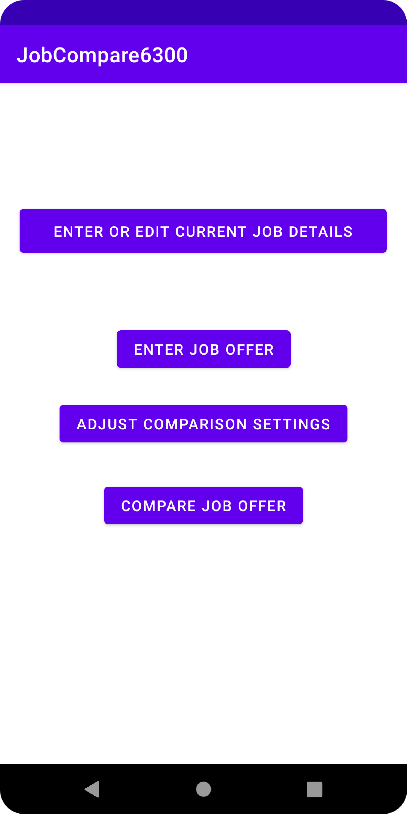
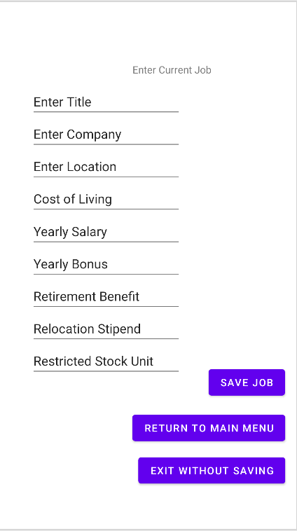
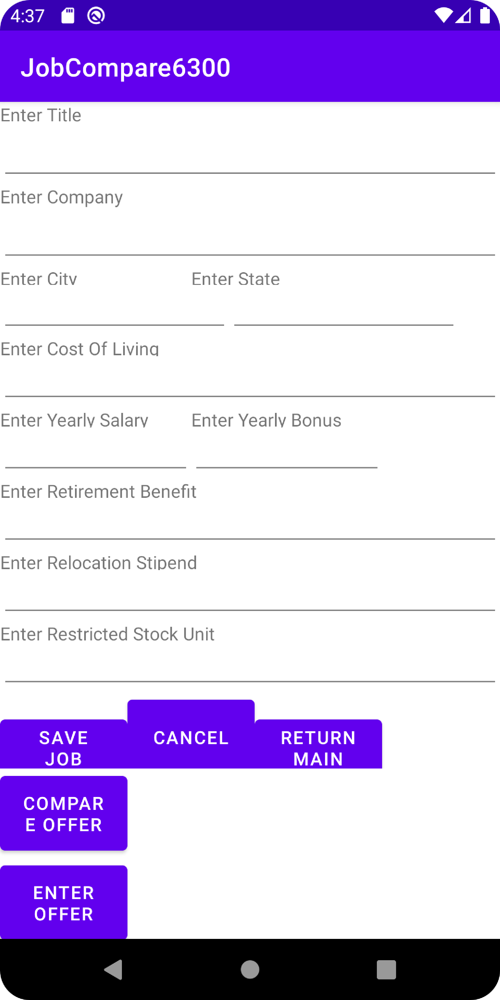
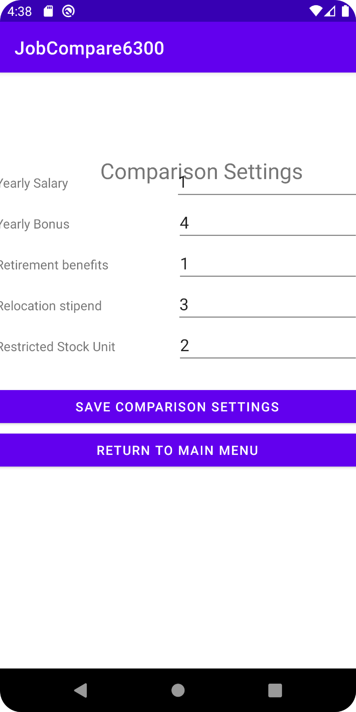
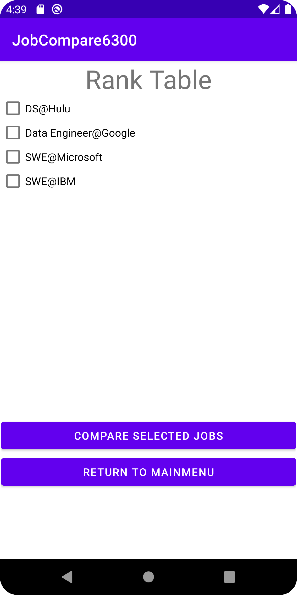
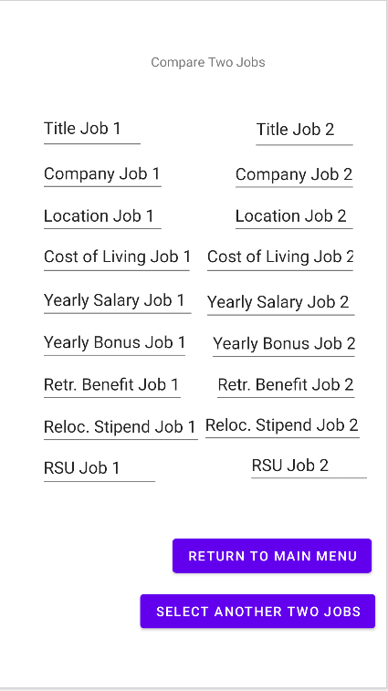

# Design Document
Author: Tariq Anees

## 1 Design Considerations
### 1.1 Assumptions
There are many software applications that compare job offers: Levels.fyi, Blind, Glassdoor etc. Although this app has unique traits compared to the software applications listed above we can’t truly look at this assignment with fresh eyes. The assumptions we’ll make in designing this new job offer application will be subconsciously guided by the apps we’ve already seen and used. One such example can be visualized during the job offer comparison activity. Our team has assumed that this layout will be displayed horizontally for the user, however nowhere in the Assignment 5 instructions is there any indication of such a layout. 

In terms of user’s data we are assuming this is persisted in a local database server. However, the Assignment 5 instructions haven’t explicitly stated that it’s required. Our UML diagram currently utilizes a Java List data structure to store a set of job offers. However, the software application will be fetching data from the local database.

### 1.2 Constraints

The first constraint is the implementation of data storage: database or application’s memory. The trade offs between the two choices will be that data is or isn’t persisted after the app closes.

The app’s default navigation after a user takes action will be a constraint. For example, will the user be automatically transitioned to the main menu or will there be buttons for the user to click on. This constraint affects our design process because we may or may not have to write the functions to navigate the app. 

### 1.3 System Environment
The hardware will be running on any android application. We’ll make the layouts backwards compatible to accommodate older devices. The java software will be JDK 11.

## 2 Architectural Design
### 2.1 Component Diagram

The component diagram provided above demonstrates the logical/physical components of the Job Offer Comparison app. The components included in this diagram are the user interface, job item, compare, peristence, database. Although the user interface is not a class that we code, it is a significant input to the app. The job item is a component that represents all the classes that compromise the current job and job offer items. The user will create/edit jobs and then stored in persistence storage. The compare component doesn't have to be a class either. It can be implemented by extracting jobs from the user's jobs.

### 2.2 Deployment Diagram

The deployment diagram has 3 main components: User Interface, Device, and Database. The database will be deployed on the device by using a SQL JDBC Connector. The Android OS provides a package called android.database.sqlite which will be our resource to connect and write to the db.

## 3 Low-Level Design
### 3.1 Class Diagram

## 4 User Interface Design
### 4.1 Start Page

### 4.2 Enter Current Job

### 4.3 Enter Job Offer

### 4.4 Adjust Comparison Setting

### 4.5 Compare Offer Page

### 4.6 Compare Two Selected Jobs

