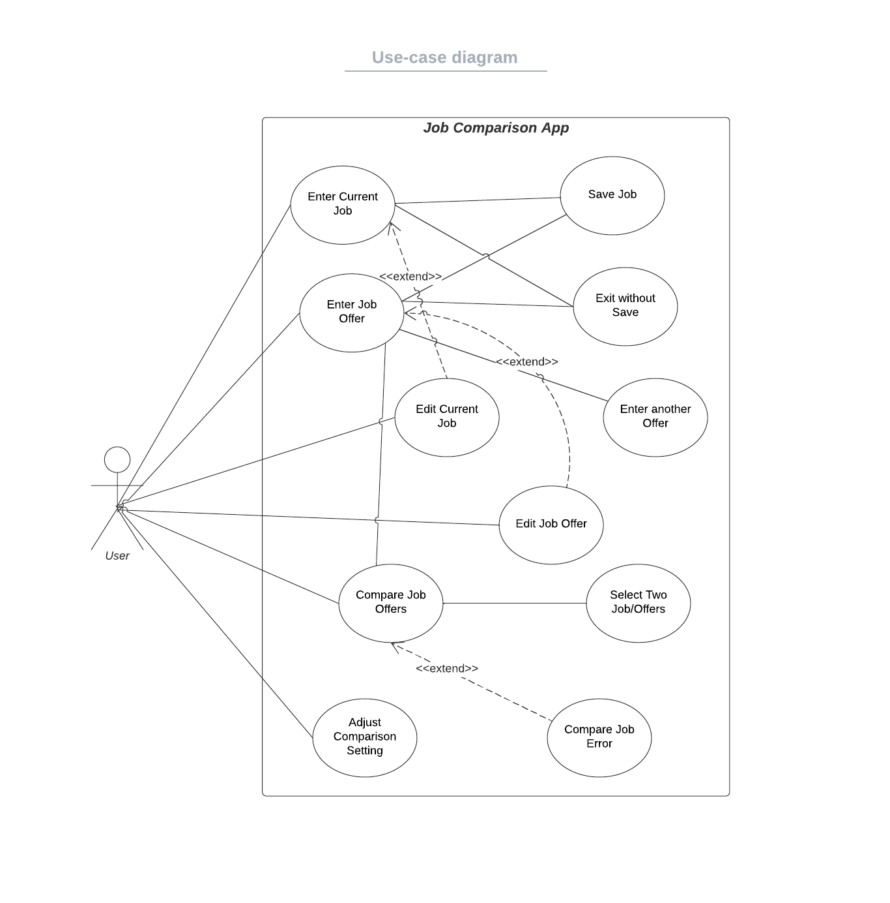

# Use Case Model

**Author**: \<team 134\>

## 1 Use Case Diagram

## 2 Use Case Descriptions

Enter Current Job

- When starting the application, the user can enter their current job
- No job is entered before.
- The user will go to the job enter page. 
- If no job is entered before, the user will enter the current job properly and choose to save or exit without saving the job information. If a job is entered, the user will be directed to edit the previous job.

Enter Job Offer

- When starting the application, the user can add job offers to the system for future comparison.
- The user must open this app.
- The user will be directed to the enter job offer page.
- The user will choose to enter one job offer at a time. If the job information is entered correctly, the user can save this job, exist without saving or enter another job.

Edit Current Job

- When the user opens the app, they can edit the current job information.
- The user must enter the job information correctly and save the job before editing.
- The user will go to the edit job page with previously entered job information.  
- If there is no job entered before, the user will be prompted to enter a job first. If one job is entered, the user will go to the edit job page.

Edit Job Offer

- When the user opens the app, they can edit job offer information.
- The user must enter at least one job offer information correctly and save the offer before editing.
- The user will show a drag-down page with all entered job offers and select one to edit.
- If no job offer is entered by the user before, the user will go to enter the job page.

Adjust comparison settings

- When the user starts the app, they can adjust comparison settings to control different weights of job information.
- The user must open the app.
- The user can change the weights of different job information to impact the final job rank scores.
-  If the user does not adjust the comparison settings, the settings will be default. Otherwise, it is based on the user's choice.

Compare Job Offers

- When the user has more than one entered job or offers, they can start a comparison.
- The user must have entered more than two jobs.
- The user can see the rank of all entered job and offers. They can then select two from all the job and offers to generate a detailed comparison table.
- If the user does not enter two jobs before, it will show a warning. Otherwise, the user can see the rank of all entered jobs based on the default or adjusted comparison settings and select two jobs for detailed comparison.