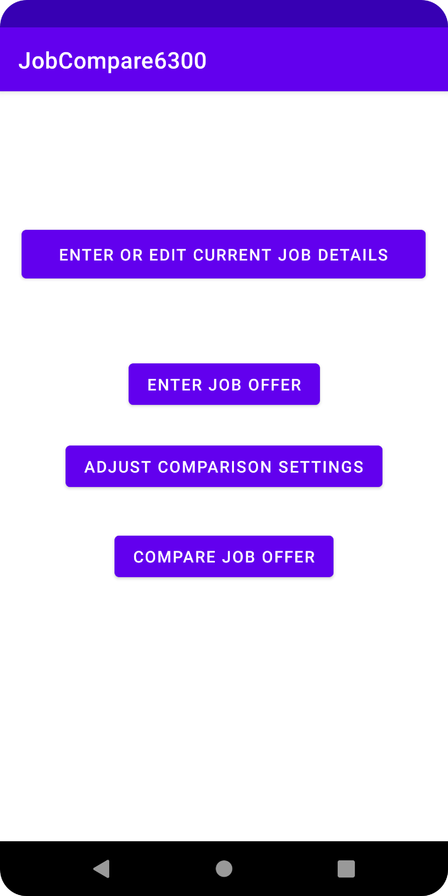

## User Manual 
Author: Nithin Dharmaraj 

## Overview of Application 
The application serves as a tool to compare various job offers of a single user. After inputting current job details as well as job offer details, the application will output a ranking from the best offer to the worst. This ranking will be take into account all the job details as well as the importance the user places in each job detail(in the form of weights). Finally the tool will allow for side by side comparison of two selected job offers. 

##Functionalities

### Main Menu:
The main menu will look like this: 

It will offer up 4 buttons: 1) enter/edit current job details 2) enter/edit job offer details 3) adjust comparison settings 4) compare job offers. This will be the main page that the user will use to interact with all the core features of the application and the first thing the user will see when the app opens. 

### Enter/Edit Current Job Details:
When the user clicks the enter/edit current job button, the app will take them to this page:

Here the user can input all the relevant job details for their current job or edit an already filled out current job. To save these details on the app, the user must click on the save job button. If the user clicks on the cancel & return to main menu, the job details will not be saved. 

### Enter Job Offer:
When the user clicks the enter job offer button, the app will take them to this page:

Here the users can input new job offer details into the system. To save these details on the app, the user must click on the save button. In order to input another job offer, the user can click on the enter offer button which will refresh the page to allow for another job offer input.
If the user wishes to return to the main menu, the user can either click the return main button or click the cancel button. The user can also click on the compare offer button to compare the various jobs inputted along with the current job inputted. This button will take the user to this page. 

This page can also be directly accessed using the compare job offers button from the main page. 

### Compare Job Offers
Here the application will display a ranking of the best to worst job offers based on the user weights inputted and the algorithm evaluating each job. The user will have an option to directly compare two jobs by selecting two jobs and clicking the compare selected jobs button. Clicking this button will lead to this page where the job details of the jobs selected will be displayed side by side of each other. 

The user will then be able to return to main menu or return to the previous page by clicking the select another two jobs button.

### Adjust Comparison Settings:
When the user clicks the adjust comparison settings button from the main menu, the app will take them to this page:

Here the user can input weights for each job detail which will help the app determine which job details to place most importance in when calculating the rank for all the jobs. The user must click on the save comparison settings button in order to save the settings. 
If the user does not edit the comparison settings, the weights will default to one for each job detail. 